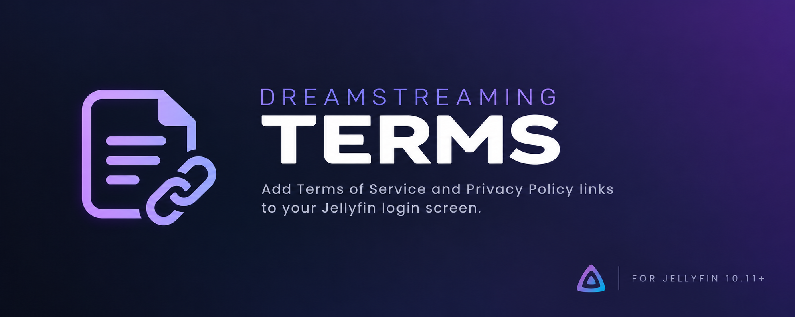

<p align="center">
  
</p>

# 🔗 Dreamstreaming Terms

A Jellyfin plugin that adds configurable **Terms of Service** and **Privacy Policy** links to the Jellyfin login screen.

The plugin allows server administrators to link to an external website or serve a local HTML document directly through Jellyfin.

Built for **Jellyfin 10.11.x**.

---

## ✨ Features

- 🔗 Add a **Terms of Service** link to the Jellyfin login screen
- 🔒 Add an optional **Privacy Policy** link
- 🌐 Use an external website URL
- 📄 Use a local `.html` or `.htm` file
- ✏️ Customize the displayed link text
- 🪟 Choose whether links open in a new tab
- • Optional separator between Terms and Privacy links
- ⚙️ Configure everything from the Jellyfin dashboard
- 🔌 Integrates with JavaScript Injector for Jellyfin Web UI integration
- 🛡️ Local server file paths are never exposed to unauthenticated clients

---

## 📋 Requirements

- Jellyfin **10.11.x**
- JavaScript Injector for Jellyfin
- .NET 9 compatible Jellyfin installation

Dreamstreaming Terms uses JavaScript Injector to add the configured links to the Jellyfin login interface.

---

## 📦 Installation

### 1. Install JavaScript Injector

Dreamstreaming Terms requires the JavaScript Injector plugin to modify the Jellyfin Web login interface.

Install a compatible version of JavaScript Injector for your Jellyfin installation and restart Jellyfin.

### 2. Add the Dreamstreaming Terms repository

Open:

**Jellyfin Dashboard → Plugins → Repositories**

Add a new repository and use:

```text
https://raw.githubusercontent.com/certified-dumbass/login-links/main/manifest.json
```

You can name the repository:

```text
Dreamstreaming Terms
```

### 3. Install the plugin

Go to:

**Dashboard → Plugins → Catalog**

Find **Dreamstreaming Terms** and install it.

Restart Jellyfin after installation.

---

## ⚙️ Configuration

After installation, open:

**Dashboard → Plugins → Dreamstreaming Terms**

The plugin can be enabled or disabled completely from its configuration page.

---

## 📜 Terms of Service

The Terms of Service link can be configured independently.

Available options include:

- Enable or disable the link
- Custom link text
- Website URL
- Local HTML file
- Open in a new tab

### External website

Select:

```text
Link type: Website URL
```

Then enter a URL, for example:

```text
https://example.com/terms
```

### Local HTML file

Select:

```text
Link type: Local HTML file
```

Then enter the full path to an HTML file on the Jellyfin server.

Example on Windows:

```text
C:\Dreamstreaming\Legal\terms.html
```

Supported file types:

```text
.html
.htm
```

The actual filesystem path is not sent to the browser. The document is instead served through the plugin's Jellyfin endpoint.

---

## 🔒 Privacy Policy

A Privacy Policy link can optionally be enabled as well.

It has the same options as the Terms of Service link:

- External URL
- Local HTML file
- Custom link text
- Open in new tab

Terms of Service and Privacy Policy can use different link types.

For example:

```text
Terms of Service
→ Local HTML file

Privacy Policy
→ External website
```

---

## 🖥️ Example

A configured Jellyfin login screen can display:

```text
                 Sign In

        Terms of Service • Privacy Policy
```

The exact text can be changed from the plugin settings.

---

## 📁 Local HTML Example

A very simple Terms of Service document could look like this:

```html
<!DOCTYPE html>
<html lang="en">
<head>
    <meta charset="UTF-8">
    <title>Terms of Service</title>
</head>

<body>

    <h1>Terms of Service</h1>

    <p>
        Welcome to our Jellyfin server.
    </p>

    <p>
        By using this server, you agree to the Terms of Service.
    </p>

</body>
</html>
```

Save the file somewhere accessible by the Jellyfin server and enter its full path in the plugin configuration.

---

## 🔧 How It Works

Dreamstreaming Terms consists of two main components.

The server-side plugin stores the configuration and provides endpoints for local HTML documents.

A small client-side script is registered with JavaScript Injector. When the Jellyfin login interface is displayed, the script adds the configured legal links to the login form.

For local documents, the flow is:

```text
Jellyfin Login
      ↓
Terms of Service
      ↓
Dreamstreaming Terms
      ↓
Local HTML file
```

The browser therefore does not need direct access to the server filesystem.

---

## 🔐 Security

The public configuration endpoint only exposes information required to display the login links.

Local filesystem paths are not included in the public configuration.

When using a local document, clients only receive a plugin route such as:

```text
/Dreamstreaming/Terms/Terms
```

instead of the actual server path.

Only `.html` and `.htm` files are accepted as local legal documents.

---

## 🧩 Compatibility

The initial release is designed for:

```text
Jellyfin 10.11.x
.NET 9
```

Because the plugin modifies the Jellyfin Web login experience through JavaScript Injector, future Jellyfin Web UI changes may require plugin updates.

---

## 🐛 Issues & Feedback

Found a bug or have an idea for the plugin?

Please open an issue in this GitHub repository and include:

- Jellyfin version
- Dreamstreaming Terms version
- JavaScript Injector version
- Relevant Jellyfin log output
- Steps to reproduce the problem

---

## 🤖 AI Assistance

Parts of this project were developed with the assistance of AI.

AI was used as a development tool for code generation, debugging, documentation, and implementation guidance.

The plugin should still be considered community software and is not officially affiliated with Jellyfin.

---

## ⚠️ Disclaimer

Dreamstreaming Terms is an unofficial Jellyfin plugin.

This project is not affiliated with, endorsed by, or maintained by the Jellyfin project.

Use it at your own risk.

---

## 💜 Enjoy!

Made for Jellyfin servers that want their legal links somewhere slightly more useful than buried in a random webpage.

Enjoy your server! 💜
